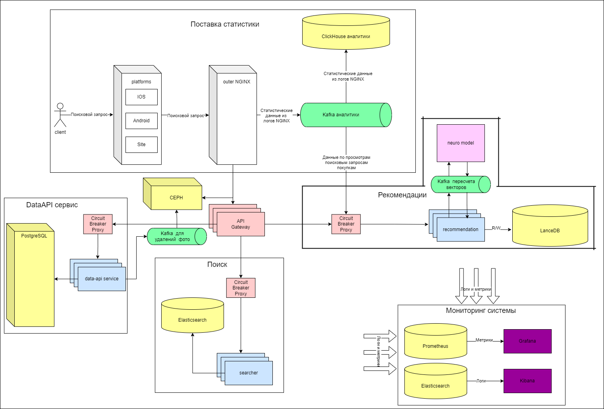

# Проектирование высоконагруженного сайта объявлений

Курсовая работа в рамках 3-го семестра программы по Веб-разработке ОЦ VK x МГТУ им. Н.Э. Баумана (ex. "Технопарк") по
дисциплине "Проектирование высоконагруженных сервисов"

#### Автор - [Максим Сиканов](https://park.vk.company/profile/m.sikanov/ "Страница на портале VK x МГТУ")

#### Задание - [Методические указания](https://github.com/init/highload/blob/main/homework_architecture.md)

#### Содержание:

1. [Тема, функционал и аудитория](#1)
2. [Расчёт нагрузки](#2)
3. [Глобальная балансировка нагрузки](#3)
4. [Локальная балансировка нагрузки](#4)
5. [Логическая схема базы данных](#5)
6. [Физическая схема базы данных](#6)
7. [Алгоритмы](#7)
8. [Технологии](#8)
9. [Схема проекта](#9)
10. [Обеспечение надёжности](#10)
11. [Расчёт ресурсов](#11)
12. [Список источников](#список-источников)

## Часть 1. Тема и целевая аудитория <a name="1"></a>

### Тема курсовой работы - **"Проектирование сайта объявлений"**

В качестве примера и аналога выбран ведущий в России сайт объявлений - [Avito](https://www.avito.ru/)

### Ключевой функционал сервиса

- Создание / редактирование / поиск / просмотр объявлений
- Создание / просмотр отзывов

### Ключевые продуктовые решения

- Поиск по названию, категориям, диапазону цены, расстоянию от покупателя

### Целевая аудитория

- 61 млн активных пользователей в месяц в странах СНГ [^1]
- В среднем пользователи проводят на Авито 11 минут в месяц [^1]
- 97% трафика поступает на Авито из России [^1]
- Демография: 56.79% мужчин и 43.21% женщин [^1]


## Часть 2. Расчёт нагрузки <a name="2"></a>

### Продуктовые метрики

MAU - 61 млн пользователей [^1]

DAU - 2 млн пользователей [^1]

#### Среднее количество действий пользователя по типам в день:

- В Авито создается ≈ `1.4 млн` объявлений в день [^1] => `0.0226 объявлений/сут` на человека
- В Авито происходит ≈ `8` сделок в секунду [^1] => `0.0113 сделок/сут` на человека
- посещаемость Авито более `384 млн` пользователей в месяц [^1] => `0.21 посещений/сут` на человека

### Технические метрики

#### Средний размер хранилища пользователя по типам:

| Хранимые данные                                 | Оценочный размер на пользователя |
|-------------------------------------------------|----------------------------------|
| Персональные данные (ФИО, почта, пароль и т.д.) | `1 КБ`                           |
| Аватар                                          | `256 КБ`                         |
| Объявление                                      | `1 МБ`                           |
| Отзыв                                           | `1 КБ`                           |

- Объявление в среднем содержит 3-4 фото (размер фото в среднем `256 КБ`) и текстовое описание. Итого ≈ `1 МБ`
- В среднем на одного пользователя приходится 5 объявления и 10 отзывов [^1]

Возьмём общее оценочное число пользователей с запасом = `80 млн` - будем использовать далее в расчётах.

Тогда общий размер хранилища в худшем
случае: `80 млн пользователей * (5 МБ на объявления + 256 КБ на аватар + 1 КБ персональные данные + 10 КБ отзывы) ≈ 249 TB`

За год можно ожидать прирост пользователей до `13 %` => `249 TB * 0.13 = 32 TB 40 GB` нового пространства может
потребоваться.

#### RPS и сетевой трафик по типам запросов:

| Тип запроса               | Средний оценочный RPS | Пиковое потребление, Гбит/с | Суммарный суточный трафик, TB/сутки |
|---------------------------|-----------------------|-----------------------------|-------------------------------------|
| Создание отзыва           | `5`                   | `-`                         | `0.0004`                            |
| Создание объявления       | `17`                  | `0.032`                     | `1.4`                               |
| Редактирование объявления | `139`                 | `0.28`                      | `11.45`                             |
| Поиск объявлений          | `140`                 | `0.024`                     | `1.02`                              |
| Просмотр отзывов          | `420`                 | `0.0008`                    | `0.034`                             |
| Просмотр объявлений       | `1120`                | `2.2`                       | `92.2`                              |

**Расчёты RPS:**

- Создание объявления: `1.4 млн объявлений в сутки / (24 * 3600) ~= 17 RPS`
- Редактирование объявления: `12 млн объявлений в сутки / (24 * 3600) ~= 139 RPS` [^2]
- Поиск объявлений: `2 млн DAU * 6 / (24 * 3600) ~= 140 RPS` при условии, что каждый сделает 6 запросов(один поисковая
  выдача ~ `90 КБ` трафика)
- Создание отзыва: `10 сделок/с * 0.5 = 5 RPS` при условии, что каждый второй будет оставлять отзыв
- Просмотр отзывов: `140 поиск/с * 3 = 420 RPS` при условии, за один поиск человек откроет отзывы 3 раза

**Расчёты трафика:**

- Средний: API + Статика: `RPS * средний размер в GB = X Гбит/с`
- Пиковый (Пиковый коэф трафика от среднего с запасом = 2): API + Статика: `2 * X Гбит/с`
- Суммарный суточный: API + Статика: `(X / 1024) * (24 * 3600) с/сут = Y TB/сут`

|          | Суммарный RPS | Суммарное пиковое потребление, Гбит/с | Суммарный суточный трафик, TB/сутки |
|----------|---------------|---------------------------------------|-------------------------------------|
| **Итог** | `1841`        | `2.62`                                | ` 115.2`                            |

## Часть 3. Глобальная балансировка нагрузки <a name="3"></a>

Для обеспечения минимального latency основную часть дата-центров следует размещать на территории, наиболее близкой к
наибольшему количеству пользователей. Так как в случае Авито 97% заказов приходится на российский рынок[^1], то ЦОДы
размещать стоит ближе всего к аудитории приложения.


Больше 50% всех объявлений находятся в Западной части России. Поэтому ДЦ лучше всего разместить в Москве. Но чтобы
обеспечить быстроту ответа для пользователей с востока - стоит также использовать ДЦ в Новосибирске. Также ДЦ в
Новосибирске будет покрывать Среднюю Россию, тем самым нагрузка на дата-центры будет приблизительно равная.


* Москва
* Новосибирск

Также эти города находятся на магистралях сети


### Нагрузка на ЦОД-ы

| ЦОД         | Область покрытия                 | Приблизительный % пользователей | Нагрузка (RPS) |
|-------------|----------------------------------|---------------------------------|----------------|
| Москва      | Западная часть России            | 55                              | 1013           |
| Новосибирск | Средняя и Восточная часть России | 45                              | 829            |

### Методы глобальной балансировки

Будем балансировать запросы с помощью Routing - BGP Anycast. Когда клиенты отправляют запросы, BGP маршрутизаторы
автоматически выбирают ближайший и наиболее доступный маршрут к нему.

## Часть 4. Локальная балансировка нагрузки <a name="4"></a>

### Схема балансировки

Так как в проекте используется роутинг с помощью BGP Anycast, балансировка на L4 может быть полезна в минимальном
количестве сценариев, так как роутинг считается эффективнее, чем LVS, а список их задач существенно пересекается.
Поэтому балансировка будет на L7 с помощью `Nginx`.

Топология балансировщика - `Промежуточный прокси`[^3]


**Так как Nginx может одновременно держать достаточно запросов [^6], то в каждом ЦОДе будем использовать 2 nginx
сервера, на которые будут приходить запросы**

Мы будем применять Nginx для следующих процессов:

- Равномерная балансировка запросов между бэкендами с помощью Least Connection
- Мультиплексирование TCP соединений с бэкендом
- Реализация API-Gateway (функциональная балансировка)
- Разрешение задачи медленных клиентов
- Терминация SSL
- Отдача статики
- Кеширование запросов
- Сжатие контента с помощью gzip
- Retry идемпотентных запросов с помощью парсинга оригинального протокола (HTTP)
- Простановка HTTP-заголовков на уровне web-сервера, например, X-Real-IP - настоящий IP клиента

Далее для оркестрации сервисов будем использовть Kubernetes, который будет обеспечивать:

- Auto-scaling
- Service discovery
- Распределение stateless сервисов по кластеру
- Управление deployment-циклом приложений

### Схема отказоустойчивости

Nginx и k8s в связке обеспечат нам высокий уровень отказоустойчивости сервиса.

### Нагрузка по терминации SSL

Для более быстрой повторной аутентификации будем использовать Session tickets.

## Часть 5. Логическая схема базы данных <a name="5"></a>

### Диаграмма


### Размер данных и нагрузка на чтение / запись

| Название таблицы | Количество строк    | Объем записи, байт | Объем данных, GB | Чтение, RPS | Запись, RPS |
|------------------|---------------------|--------------------|------------------|-------------|-------------|
| User             | `80.000.000`        | `200`              | `15`             | `420`       | `4`         |
| User_rating      | `80.000.000`        | `6`                | `0.5`            | `420`       | `5`         |
| User_vector      | `80.000.000`        | `1204`             | `89.7`           | `23`        | `23`        |
| User_actions     | `1.000.000.000.000` | `16`               | `14901.1`        | `1`         | `1260`      |
| Feedback         | `350.000.000`       | `100`              | `32.6`           | `420`       | `5`         |
| Announcement     | `300.000.000`       | `1000`             | `280`            | `1260`      | `17`        |
| Name_search      | `300.000.000`       | `40`               | `11.9`           | `140`       | `17`        |

P.s: Один вектор в таблице `User_vector` будет отражать степень интереса пользователя к каждой из категорий. Значит
длинна такого вектора будет равна количеству категорий. На [Avito](https://www.avito.ru/) сейчас <300 категорий и
подкатегорий. В нашем случае будем считать, что максимальная длинна вектора 300, этого хватит с запасом.

## Часть 6. Физическая схема базы данных <a name="6"></a>

### Выбор СУБД

Для хранения данных в качестве СУБД выбран *PostgreSQL*.

**Причины:**

1. Нагрузка на базу данных будет не более 3000 PRS, что позволяет использовать PostgreSQL. Транзакционная модель
   позволит не переживать за консистентность данных.
2. Наличие модуля для работы с географическими данными[^4], что существенно ускорит поиск в радиусе от пользователя.
3. Надежность.
4. Встроенный функционал для создания дампов базы и их выгрузки.

#### Клиентские библиотеки

**PgBouncer**[^7] для мультиплексирования подключений.

**PostGiST**[^4] для работы с геоданными.

### Индексы

1. B-tree (для всех FK): Feedback.user_id, Feedback.user_writer_id, User_rating.user_id, Announcement.user_id
2. GiST: Announcement.point

### Репликация

Будет использоваться **физическая репликация** всей БД в СУБД PostgreSQL. **В случае падения одного из серверов, запросы
будут идти на второй сервер.**

**Схема репликации master-master:**


### Шардинг

Так как таблицы в PostgresSQL не очень большие, то все индексы можно поместить в память одной машины[^19]. Поэтому
шардинг для PostgresSQL можно не использовать.

Для остальных хранилищ ситуация аналогична.

### Хранение фото и превью

**Сетевая файловая система (CEPH)** по следующим причинам:

1. На хранение всех фото и превью нужно до `251 TB`, использование S3 может быть слишком дорогим в долгосрочной
   перспективе.
2. Масштабируемая, отказоустойчивая и гибкая распределенная файловая система, подходит для хранения больших объемов
   данных.
3. Можно настраивать систему под свои нужды.

#### Поисковая система

Таблица `Name_search` будет расположена в **Elasticsearch**, что обеспечит более эффективнй поиск.

### Рекомендации и аналитика

**Clickhouse**, куда будут писаться нужные данные для аналитики (например, различная активность пользователей). На
основе этих данных будут строиться рекомендации. ML вектора для рекомендаций будут храниться в **LanceDB**.

## Часть 7. Алгоримты <a name="7"></a>

Рекомендательная система, основанная на нейронной сети, которая будет анализировать запросы клиентов для предложения
подходящих товаров.

Нейронная сеть: Рекомендательная модель, которая будет обучаться на основе данных о предпочтениях клиентов и
характеристиках товаров. Будет использоваться Модель на основе LSTM TensorFlow[^9].


#### Рабочий процесс:

1) Читатель нажимает на главную страницу / заходит в приложение
2) Веб-сервер перенаправляет запрос в службу Rec
3) Служба Rec вызывает службу model и передает user_id и top N элементов в качестве параметров
4) Model service пересылает запрос одному из воркеров, который использует модель для прогнозирования, и возвращает 20
   announcement_id в качестве рекомендаций
5) Затем служба Rec обращается к базе данных Postgres, чтобы получить информацию

#### Хранение векторов

По каждому пользователю будет храниться вектор в СУБД `LanceDB`[^10].


#### Конфигурации

- Обучаем модель на мощном сервере с GPU
- При открытии главной страницы выполняется запрос в нейро сервис.
- К базе с `user_search` ~ 100 RPS. На один запрос процессорного времени сервера с базой
  данных: `100 ns доступ к памяти + 10 ms получение N элементов`, значит достаточно 2-х серверов с Postgres со следущими
  конфигурациями 2x6338/16x32GB/2xSSD4T/2x25Gb/s, на этих же серверах будут работать воркеры, предоставляющие API для
  взаимодействия с нейронной сетью.
- Время ответа нейронной сети - `100 ms`, поэтому нужно будет запустить 20 воркеров, которые будут балансироваться с
  помощью NGINX.

## Часть 8. Технологии <a name="8"></a>

| Технология    | Применение                                        | Обоснование                                                                                                              |
|---------------|---------------------------------------------------|--------------------------------------------------------------------------------------------------------------------------|
| Go            | Backend, основной язык сервисов                   | Производительность, удобен для микросервисной архитектуры, низкий порог входа, популярный, большое количество технологий |
| Python        | Backend, модель для рекомендаций                  | Решения из коробки, быстрая и дешевая разработка                                                                         |
| Angular TS    | Frontend                                          | Строгая типизация, компонентный подход, быстрая разработка, множество решений из коробки                                 |
| Kotlin/Swift  | Мобильная разработка                              | Популярно                                                                                                                |
| Nginx         | Proxy balancer                                    | Многофункциональный, популярный, хорошо конфигурируется                                                                  |
| Kafka         | Асинхронный стриминговый сервис, брокер сообщений | Надежный, производительный по сравнению с RebbitMQ, отложенное эффективное выполнение задач, партицирование из коробки   |
| PostgreSQL    | Хранилище SQL, основная БД сервисов               | Подходит для реляционного хранения данных большинства CRUD-сервисов, популярный, низкий порог входа                      |
| LanceDB       | Хранилище векторов                                | Производительный[^10], удобный                                                                                           |
| Elasticsearch | Хранилище логов; полнотекстный поиск              | Популярный, удобный[^14]                                                                                                 |
| ClickHouse    | Хранилище аналитических данных                    | Эффективная работа с OLAP-нагрузкой, производительный[^11]                                                               |
| Prometheus    | Хранилище метрик и система работы с ними          | Популярный, производительный                                                                                             |
| CEPH          | Хранилище статики: фото, превью                   | Не дорогой вариант, надежный, масштабируемый                                                                             |
| Vault         | Хранилище секретов                                | Удобный, популярный                                                                                                      |
| Grafana       | Графики, мониторинг и алёрты                      | Удобный, популярный, гибкий                                                                                              |
| Kibana        | Просмотр логов                                    | Удобный, популярный, гибкий                                                                                              |
| Docker        | Контейниризация                                   | Удобно для разработки и работы внутри k8s                                                                                |
| Kubernetes    | Deploy                                            | Масштабирование, отказоустойчивость, оптимальная утилизация ресурсов                                                     |

## Часть 9. Схема проекта <a name="9"></a>



Сервисы:

1. **DataAPI сервис** отвечает за простые CRUD операции. Также при удалении объявлений этот сервис отправляет в кафку
   сообщение для удаления изображения из хранилища изображений.
2. **Поиск** отвечает за поиск объявлений. В случае поиска по названию - ищет id объявлений в Elasticsearch. Затем
   формирует запрос с нужными фильтрами и через `API Gateway` запрашивает нужные объявления из **DataAPI сервис**.
3. **Рекомендации** создают и пересчитывают вектора пользователей для рекомендаций. Действия пользователей (просмотр и
   поиск) попадают в neuro модель для пересчета векторов. Когда пользователь запрашивает рекомендуемые объявлений, то
   сервис рекомендаций на основе вектора пользователя через `API Gateway` запрашивает нужные объявления из **DataAPI
   сервис**.

## Часть 10. Обеспечение надёжности <a name="10"></a>

Система должна быть устойчива к сбоям, тогда её можно назвать отказоустойчивой.

### Аппаратные сбои

#### Дата-центры

- Резервирование физических линии связи
- Резервирование охлаждения
- Распределённые и независимые ДЦ
- Периодические учения с отключением ДЦ
- Две линии питания
- Аварийные дизель-генераторы
- Бесперебойное питание
- В случае отказа одного из ДЦ нагрузка на другой может быть равна пиковой нагрузке всего приложения, поэтому
  конфигурации каждого ДЦ должны позволять единолично выдерживать всю нагрузку.

#### Сервисы

- Резервирование ресурсов (CPU, RAM)
- Резервирование физических компонентов (сервера, диски и т.д.)
- Резервирование хранилищ — [схема реплецирования](#Репликация)
- ClickHouse — внутренняя система реплицирования[^13]
- Наличие реплик для каждого сервиса, а также балансер, который распределяет нагрузку между репликами
- Сбор логов и метрик
- Отслеживане различных метрик (CPU, RAM и т.д.) с помощью дашбордов
- Использование брокеров сообщений для асинхронного взаимодействия
- Использование архитектурных паттернов:
    - Circuit Breaker[^12] - позволяет перекрыть сервис, который начинает слишком часто возвращать ошибки. В таком
      случае у сервиса будет время для восстановления
    - Timeout[^12] - если сервис не отвечает дольше установленного времени, то мы перестаем ждать ответ и отправляем
      запрос в реплику, если она есть. Если реплики нет, то возвращаем ошибку.
- Graceful shutdown - механизм, который позволяет понять, что система по какой-то причине намерена завершить процесс,
  чтобы программа могла очистить ресурсы и завершить все процессы.
- Graceful degradation - принцип разработки, который предусматривает, чтобы при возникновении проблем или недоступности
  определенных функций или ресурсов приложение продолжало работать, предоставляя пользователю максимально возможный
  функционал. То есть, при возникновении проблем приложение может "спадать" до менее функционального состояния, но при
  этом оставаться работоспособным, вместо полного отказа в работе.

### Программные ошибки

- Сбор логов и метрик
- Алёртинг инцидентов

### Человеческий фактор

- Тестирование (от модульных до комплексного и ручного)
- Настроенные CI/CD с тестированием и деплоем + удобное восстановление
- Подробный и ясный мониторинг
- Документация системы

### Безопасность

- Виртуальный уровень защиты [^21]
    - Приложение должно быть устойчиво к уязвимостям из OWASP Top Ten[^20] и другим рискам безопасности.
    - Доступы к различным компонентам системы должны быть строго разграничены.
- Физический уровень защиты [^21]
    - Контроль доступа в дата-центр
    - Дополнительная защита инженерных компонентов
    - Пожарная безопасность ЦОД

## Часть 11. Расчёт ресурсов <a name="11"></a>

### Конфигурации одного ДЦ

```
Далее используем пиковую нагрузку по RPS (коэффициент 1.5)
```

#### Нагрузка на хранилища и СУБД

| Система       | Объем данных, TB | Чтение, RPS                  | Запись, RPS            | Трафик      |
|---------------|------------------|------------------------------|------------------------|-------------|
| ClickHouse    | 15               | 1                            | 1260 * 1.5 = 1890      | < 1 Mbit/s  |
| Elasticsearch | 0.017            | 140 * 1.5 = 210              | (17 + 139) * 1.5 = 234 | -           |
| CEPH          | 251              | (1120 + 14000) * 1.5 = 22680 | (17 + 139) * 1.5 = 234 | 2.4 Gbit/s  |
| PostgreSQL    | 1                | 2660 * 1.5 = 3990            | 48 * 1.5 = 72          | < 20 Mbit/s |
| LanceDB       | 0.1              | 23 * 1.5 = 35                | 23 * 1.5 = 35          | < 2 Mbit/s  |

### Балансировка

**Nginx**: до 23762 RPS

Согласно тестированию nginx[^16][^17] бюджетный
сервер `CPU: 4 core | RAM: 32 GB |HDD: 500 GB | NIC: Intel X710 2×10 Gbe` сможет выдерживать нашу нагрузку. Для
обеспечания отказоустойчивости, каждый ДЦ будет содержать 2 nginx сервера.

#### Нагрузка на сервисы

| Сервис         | Нагрузка, RPS                              | Net, Mbit/s |
|----------------|--------------------------------------------|-------------|
| Поиск          | 140 * 1.5 = 210                            | 3           |
| DataAPI сервис | (17 + 139 + 140 + 420 + 1120) * 1.5 = 2754 | 300         |
| Рекомендации   | (200 + 100) * 1.5 = 450                    | 1           |
| API Gateway    | 210 + 2754 + 450 = 3414                    | 303         |

Все сервисы написаны на Go и выполняют легкую бизнес логику. Тогда можно предположить, что 1 ядро CPU выдержит 100 RPS и
1 запрос в среднем 50 кб RAM).

### Требуемые ресурсы

| Сервис                | CPU, cores | RAM, GB | Disk   | Count |
|-----------------------|------------|---------|--------|-------|
| ClickHouse            | 16         | 32      | 24 TB  | 1     |
| Elasticsearch - поиск | 8          | 32      | 32 GB  | 1     |
| CEPH                  | 64         | 256     | 251 TB | 1     |
| PostgreSQL            | 16         | 256     | 2 TB   | 1     |
| Поиск                 | 3          | 0.01    | -      | 2     |
| DataAPI сервис        | 28         | 0.2     | -      | 2     |
| Рекомендации          | 5          | 0.03    | -      | 2     |
| API Gateway           | 35         | 0.2     | -      | 2     |
| LanceDB               | 16         | 32      | 256 GB | 1     |

Основной критерий для определения количества ядер - время работы процессора в зависимости от ситуации[^18]

### Сервера

| Сервис                | Хостинг | Configuration                                                | Cores | Count | Покупка[^22], $ | Аренда[^23], $/мес |
|-----------------------|---------|--------------------------------------------------------------|-------|-------|-----------------|--------------------|
| ClickHouse            | own     | AMD EPYC 7543P / 4x8GB / 12x NVMe 2 TB                       | 32    | 1     | 5000            | 430                |
| Elasticsearch - поиск | own     | A2SDi-16C-HLN4F- 16-Core C3955 Atom / 4x8GB / 1x NVMe 32 GB  | 16    | 1     | 2000            | 320                |
| CEPH                  | own     | AMD EPYC 7713P / 8x32GB / 24x NVMe 12 TB                     | 64    | 1     | 8000            | 900                |
| PostgreSQL            | own     | AMD EPYC 7543P / 8x32GB / 2x NVMe 1 TB                       | 32    | 1     | 5500            | 500                |
| LanceDB               | own     | A2SDi-16C-HLN4F- 16-Core C3955 Atom / 4x8GB / 1x NVMe 256 GB | 16    | 1     | 2000            | 320                |
| Nginx                 | own     | Intel Xeon E-2314 Processor - / 4x8GB / HDD: 500 GB          | 4     | 2     | 1000            | 80                 |
| ML Service            | own     | AMD EPYC 7543P  /  8x8GB / - / 4 GPU × 16 GB                 | 32    | 1     | 5000            | 430                |
| kubenode              | own     | 2x6338 / 1x128MB / 1x NVMe 256 MB                            | 4     | 38    | -               | -                  |

Для всех сервисов нужно 19 kubenode, но у каждого сервиса есть реплика, поэтому берем с запасом x2.

Все kubenode будут разнесены на 2 физических сервера. На каждом сервере будет 19 kubenode (для обеспечения
отказоусточивости).

| Сервис | Хостинг | Configuration                        | Cores | Count | Покупка[^22], $ | Аренда[^23], $/мес |
|--------|---------|--------------------------------------|-------|-------|-----------------|--------------------|
| kuber  | own     | AMD EPYC 9634 / 1x4GB / 1x NVMe 8 GB | 84    | 2     | 15000           | 1100               |

В нашем случае каждый ДЦ будет содержать перечисленные сервера.

### Затраты на железо:

#### Покупка

- Стоимость одного датацентра:  `5000 + 2000 + 8000 + 5500 + 2000 + 2*1000 + 5000 + 2*15000 = 59500$`
- Будем предполагать обновление железа 1 раз в 5 лет, тогда стоимость в год будет: `59500 / 5 = 11900$`
- Поскольку у нас 2 датацентра, то общая стоимость железа в год будет `2 * 11900 = 23800$`

#### Аренда

- Стоимость одного датацентра:  `430 + 320 + 900 + 500 + 320 + 2*80 + 430 + 2*1100 = 5260$/мес`
- Поскольку у нас 2 датацентра, то общая стоимость железа в год будет `2 * 11900 = 126240$`

#### Итог

Выгоднее купить железо, тогда стоимость в год будет `23800$`.

## Список источников:

[^1]: [Статистика Авито в 2024 году](https://inclient.ru/avito-stats/#avito)

[^2]: [Авито Playbook](https://github.com/avito-tech/playbook)

[^3]: [Введение в современную сетевую балансировку и проксирование](https://habr.com/ru/companies/vk/articles/347026/)

[^4]: [Руководство по PostGIS: 4.5. Построение индексов](https://pgdocs.ru/postgis/ch04_5.html)

[^6]: [Nginx: принципы работы и настройка](https://1cloud.ru/blog/nginx_work_and_setup)

[^7]: [PgBouncer для PostgreSQL](https://learn.microsoft.com/ru-ru/azure/postgresql/flexible-server/concepts-pgbouncer)

[^8]: [Способы резервного копирования на PostgreSQL](http://www.spbdev.biz/blog/sposoby-rezervnogo-kopirovaniya-na-postgresql)

[^9]: [Построение рекомендательных систем с использованием нейронных сетей](https://nnov.hse.ru/data/2018/05/24/1149415737/Построение%20рекомендательных%20систем%20с%20использованием%20нейронных%20сетей.pdf)

[^10]: [Векторные СУБД и другие инструменты для разработки ML-моделей](https://habr.com/ru/companies/beeline_cloud/articles/806815/)

[^11]: [Производительность | ClickHouse Docs](https://clickhouse.com/docs/ru/introduction/performance)

[^12]: [Паттерн Circuit Breaker](https://habr.com/ru/companies/otus/articles/778574/)

[^13]: [Репликация данных Clickhouse](https://clickhouse.com/docs/ru/engines/table-engines/mergetree-family/replication)

[^14]: [Benchmarking and sizing Elasticsearch](https://www.elastic.co/blog/benchmarking-and-sizing-your-elasticsearch-cluster-for-logs-and-metrics)

[^16]: [NGINX Plus Sizing Guide: How We Tested](https://www.nginx.com/blog/testing-the-performance-of-nginx-and-nginx-plus-web-servers/)

[^17]: [Testing the Performance of NGINX and NGINX Plus Web Servers](https://www.nginx.com/blog/nginx-plus-sizing-guide-how-we-tested/)

[^18]: [Latency Numbers Every Programmer Should Know](https://gist.github.com/jboner/2841832)

[^19]: [B-Tree индекс и его производные в PostgreSQL](https://habr.com/ru/companies/quadcode/articles/696498/)

[^20]: [OWASP Top Ten](https://owasp.org/www-project-top-ten/)

[^21]: [Системы защиты центра обработки данных (ЦОД)](https://ixcellerate.ru/news/bezopasnost-cod/)

[^22]: [Rackmount Servers](https://www.broadberry.eu/rackmount-servers)

[^23]: [ИТ-Сопровождение компаний](https://www.it-lite.ru/)

