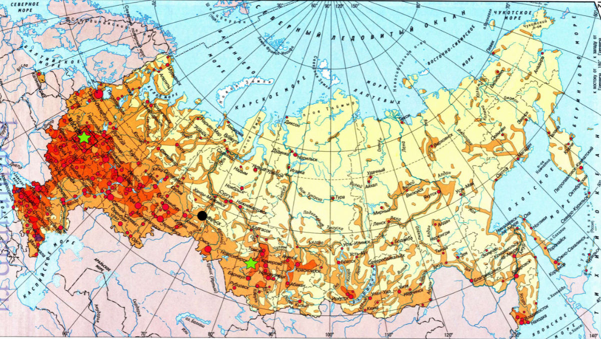
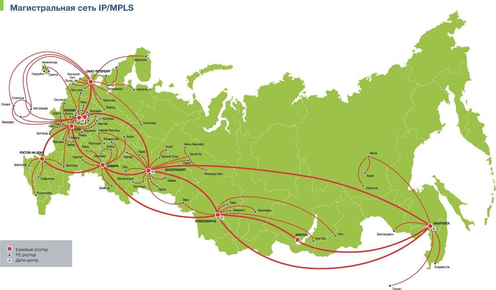
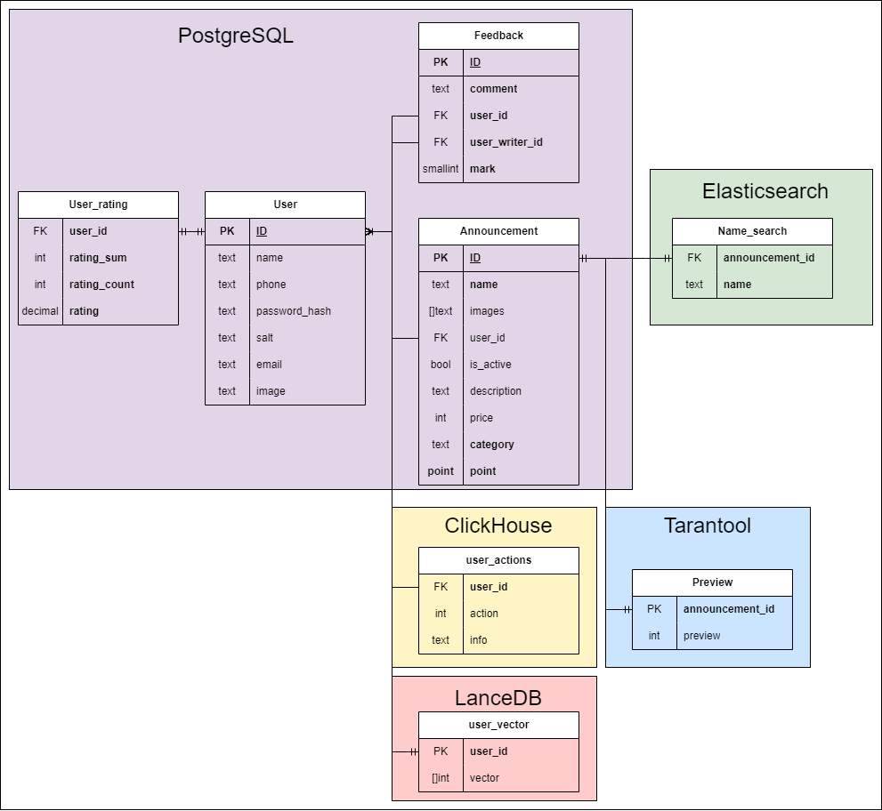

# Проектирование высоконагруженного сайта объявлений

Курсовая работа в рамках 3-го семестра программы по Веб-разработке ОЦ VK x МГТУ им. Н.Э. Баумана (ex. "Технопарк") по
дисциплине "Проектирование высоконагруженных сервисов"

#### Автор - [Максим Сиканов](https://park.vk.company/profile/m.sikanov/ "Страница на портале VK x МГТУ")

#### Задание - [Методические указания](https://github.com/init/highload/blob/main/homework_architecture.md)

#### Содержание:

1. [Тема, функционал и аудитория](#1)
2. [Расчёт нагрузки](#2)
3. [Глобальная балансировка нагрузки](#3)
4. [Локальная балансировка нагрузки](#4)
5. [Логическая схема базы данных](#5)
6. [Физическая схема базы данных](#6)
7. [Алгоритмы](#7)
8. [Технологии](#8)
9. [Обеспечение надёжности](#9)
10. [Схема проекта](#10)
11. [Расчёт ресурсов](#11)

## Часть 1. Тема и целевая аудитория 

### Тема курсовой работы - **"Проектирование сайта объявлений"**

В качестве примера и аналога выбран ведущий в России сайт объявлений - [Avito](https://www.avito.ru/)

### Ключевой функционал сервиса

- Создание / редактирование / поиск / просмотр объявлений
- Создание / просмотр отзывов

### Ключевые продуктовые решения

- Поиск по названию, категориям, диапозону цены, расстоянию от покупателя

### Целевая аудитория

- 61 млн активных пользователей в месяц в странах СНГ [^1]
- В среднем пользователи проводят на Авито 11 минут в месяц [^1]
- 97% трафика поступает на Авито из России [^1]
- Демография: 56.79% мужчин и 43.21% женщин [^1]

## Часть 2. Расчёт нагрузки 

### Продуктовые метрики

MAU - 61 млн пользователей [^1]

DAU - 2 млн пользователей [^1]

#### Среднее количество действий пользователя по типам в день:

- В Авито создается ≈ `1.4 млн` объявлений в день [^1] => `0.0226 объявлений/сут` на человека
- В Авито происходит ≈ `8` сделок в секунду [^1] => `0.0113 сделок/сут` на человека
- посещаемость Авито более `384 млн` пользователей в месяц [^1] => `0.21 посещений/сут` на человека

### Технические метрики

#### Средний размер харанилища пользователя по типам:

| Хранимые данные                                 | Оценочный размер на пользователя |
|-------------------------------------------------|----------------------------------|
| Персональные данные (ФИО, почта, пароль и т.д.) | `1 КБ`                           |
| Аватар                                          | `256 КБ`                         |
| Объявление                                      | `1 МБ`                           |
| Отзыв                                           | `1 КБ`                           |

- Объявление в среднем содержит 3-4 фото (размер фото в среднем `256 КБ`) и текстовое описание. Итого ≈ `1 МБ`
- В среднем на одного пользователя приходится 5 объявления и 10 отзывов [^1]

Возьмём общее оценочное число пользователей с запасом = `80 млн` - будем использовать далее в расчётах.

Тогда общий размер хранилища в худшем
случае: `80 млн пользователей * (5 МБ на объявления + 256 КБ на аватар + 1 КБ персональные данные + 10 КБ отзывы) ≈ 249 ТБ`

За год можно ожидать прирост пользователей до `13 %` => `249 ТБ * 0.13 = 32 ТБ 40 ГБ` нового пространстра может
потребоваться.

#### RPS и сетевой трафик по типам запросов:

| Тип запроса               | Средний оценочный RPS | Пиковое потребление, Гбит/с | Суммарный суточный трафик, Тб/сутки |
|---------------------------|-----------------------|-----------------------------|-------------------------------------|
| Создание объявления       | `17`                  | `0.03`                      | `1.4`                               |
| Редактирование объявления | `139`                 | `0.24`                      | `11.45`                             |
| Поиск объявлений          | `14140`               | `4.1`                       | `173.03`                            |
| Просмотр объявлений       | `1120`                | `2.2`                       | `92.2`                              |
| Создание отзыва           | `5`                   | `-`                         | `0.0004`                            |
| Просмотр отзывов          | `420`                 | `0.0008`                    | `0.034`                             |

**Расчёты RPS:**

- Создание объявления: `1.4 млн объявлений в сутки / (24 * 3600) ~= 17 RPS`
- Редактирование объявления: `12 млн объявлений в сутки / (24 * 3600) ~= 139 RPS` [^2]
- Поиск объявлений: `2 млн DAU * 6 / (24 * 3600) ~= 140 RPS` при условии, что каждый сделает 6 запросов
- Поиск объявлений: `140 * 100 ~= 14000 RPS` при условии, что каждый поиск будет сожержать 100 объявлений (такая
  страничка весит `15 МБ`)
- Создание отзыва: `10 сделок/с * 0.5 = 5 RPS` при условии, что каждый второй будет оставлять отзыв
- Просмотр отзывов: `140 поиск/с * 3 = 420 RPS` при условии, за один поиск человек откроет отзывы 3 раза

**Расчёты трафика:**

- Средний: API + Статика: `RPS * средний размер в ГБ = X Гбит/с`
- Пиковый (Пиковый коэф трафика от среднего с запасом = 2): API + Статика: `2 * X Гбит/с`
- Суммарный суточный: API + Статика: `(X / 1024) * (24 * 3600) с/сут = Y Тб/сут`

|          | Суммарный RPS | Суммарное пиковое потребление, Гбит/с | Суммарный суточный трафик, Тб/сутки |
|----------|---------------|---------------------------------------|-------------------------------------|
| **Итог** | `15841`       | `6.57`                                | `278.11`                            |

## Часть 3. Глобальная балансировка нагрузки 

Для обеспечения минимального latency основную часть дата-центров следует размещать на территории, наиболее близкой к
наибольшему количеству пользователей. Так как в случае Авито 97% заказов приходится на российский рынок[^1], то ЦОДы
размещать стоит в наиболее густонаселённых регионах РФ.

Поэтому были выбраны следующие города для установки датацентров:

* Москва
* Ростов-на-Дону
* Санкт-Петербург
* Екатеринубрг
* Иркутск

Также эти города находятся на магистралях сети

### Нагрузка на ЦОД-ы

| ЦОД             | Область покрытия                       | Приблизительный % пользователей | Нагрузка (RPS) |
|-----------------|----------------------------------------|---------------------------------|----------------|
| Москва          | Москва, Московская область             | 27.5                            | 4356.2         |
| Ростов-на-Дону  | Юг                                     | 15.1                            | 2392           |
| Санкт-Петербург | Санкт-Петербург, Ленинградская область | 12.1                            | 1916.8         |
| Екатеринубрг    | Средняя часть России                   | 24                              | 3801.8         |
| Иркутск         | Сибирь, Восток                         | 19.3                            | 3057.3         |

### Методы глобальной балансировки

Будем балансировать запросы с помощью Routing - BGP Anycast. Когда клиенты отправляют запросы, BGP маршрутизаторы
автоматически выбирают ближайший и наиболее доступный маршрут к нему.

## Часть 4. Локальная балансировка нагрузки 

### Cхема балансировки

Так как в проекте используется роутинг с помощью BGP Anycast, балансировка на L4 может быть полезна в минимальном
количестве сценариев, так как роутинг считается эффективнее, чем LVS, а список их задач существенно пересекается.
Поэтому балансировка будет на L7 с помощью `Nginx`.

Топология балансировщика - `Промежуточный прокси`[^3]

**Чтобы обеспечивать отказоустойчивость и выдерживать нагрузу на всю систему может понадобиться около 300 серверов,
которые распределим по ЦОДам в зависимости от нагрузок**

**Так как Nginx может одновременно держать достаточно запросов [^6], то в каждом ЦОДе будем использовать 3 nginx
сервера, на которые будут приходить запросы**

Мы будем применять Nginx для следующих процессов:

- Равномерная балансировка запросов между бэкендами с помощью Least Connection
- Мультиплексирование TCP соединений с бэкендом
- Реализация API-Gateway (функциональная балансировка)
- Разрешение задачи медленных клиентов
- Терминация SSL
- Отдача статики
- Кеширование запросов
- Сжатие контента с помощью gzip
- Retry идемпотентных запросов с помощью парсинга оригинального протокола (HTTP)
- Простановка HTTP-заголовков на уровне web-сервера, например, X-Real-IP - настоящий IP клиента

Далее для оркестрации сервисов будем использовть Kubernetes, который будет обеспечивать:

- Auto-scaling
- Service discovery
- Распределение stateless сервисов по кластеру
- Управление deployment-циклом приложений

### Схема отказоустойчивости

Nginx и k8s в связке обеспечат нам высокий уровень отказоустойчивости сервиса.

### Нагрузка по терминации SSL

Для более быстрой повторной аутентификации будем использовать Session tickets.

## Часть 5. Логическая схема базы данных 

### Диаграмма

### Размер данных и нагрузка на чтение/запись

[Расчёт нагрузки](#2)

| Название таблицы | Количество строк | Примерный размер записи, байт | Объем данных, Гб |
|------------------|------------------|-------------------------------|------------------|
| User             | `80.000.000`     | `200`                         | `15`             |
| User_rating      | `80.000.000`     | `6`                           | `0.5`            |
| Feedback         | `350.000.000`    | `100`                         | `32.6`           |
| Announcement     | `300.000.000`    | `1000`                        | `280`            |
| Distance_search  | `200.000.000`    | `6`                           | `1.2`            |
| Category_search  | `200.000.000`    | `40`                          | `7.5`            |
| Name_search      | `200.000.000`    | `40`                          | `7.5`            |
| Price_search     | `200.000.000`    | `4`                           | `0.8`            |

## Часть 6. Физическая схема базы данных 

### Выбор СУБД

Для хранения данных в качестве СУБД выбран *PostgreSQL*.

**Причины:**

1. Нагрузка на базу данных будет не более 1500 PRS, что позволяет использовать PostgreSQL. Большая часть нагрузки (~
   14000 PRS) на хранилице фото.
2. Наличие модулей для полнотекстного поиска[^5], а также модуля для работы с географическими данными[^4], что
   существенно ускорит поиск по названию товара и поиск в радиусе от пользователя.
3. Надежность.
4. Встроенный функционал для шардирования данных.
5. Встроенный функционал для создания дампов базы и их выгрухки.

#### Клиентские библиотеки

*PgBouncer* для мультиплексирование подключений будем использовать[^7].

*PostGiST* для работы с геоданными[^5].

### Индексы

1. B-tree (для всех FK): Distance_search.announcement_id, Category_search.announcement_id, Name_search.announcement_id,
   Price_search.announcement_id, Feedback.user_id, Feedback.user_writer_id, User_rating.user_id, Announcement.user_id
2. GiST: Distance_search.point

#### Поисковая система

Таблица `Name_search` будет расположена в *Elasticsearch*, что обеспечит более эффективнй поиск.

### Репликация

Будет использоваться **физическая репликация**.

#### Схема

В случае падения мастера, будет переключкение на синхронную реплику. Все реплики read-only.

### Шардинг

Чтобы PostgreSQL выдерывал наши нагрузки потребуется использовать шардинг.

**Shard key для таблиц:**

1. Announcement: category (чтение и забись объявлений в большенстве случаев будет приходиться только на один шард).
   Количество шардов = количество категорий.
2. Feedback: hash(user_id) mod 1000 (отзывы на человека будут находиться в одндом шарде, что удобно в случае чтения).
   `420 RPS` - просмотр объявлений, поэтому необходим `21`  шард.
3. User: hash(id) mod 1000 - `70 RPS + 420 RPS = 490 RPS` - входы и просмотр пользователей, поэтому необходимо `25`
   шардов.

### Хранение фото

**Сетевая файловая система (CEPH)** по следующим причинам:

1. На хранение всех фото нужно до `250 Тб`, использование S3 может быть слишком дорогим в долгосрочной перспективе.
2. Масштабируемая, отказоустойчивая и гибкая распределенная файловая система, подходит для хранения больших объемов
   данных.
3. Можно настраивать систему под ваши нужды.

### Хранение фото (превью) в кэше

Т.к. вес одного превью `не более 10 Кб`, их все можно доставать из оперативной памяти. Для работы с кэшем будем
использовать key-value хранилище **Tarantool**.

### Аналитика

**Clickhouse**, куда будут писаться нужные данные для аналитики (например, различная активность пользователей).

## Часть 7. Алгоримты 

Рекомендательная система, основанная на нейронной сети, которая будет анализировать запросы клиентов для предложения
подходящих товаров.

Нейронная сеть: Рекомендательная модель, которая будет обучаться на основе данных о предпочтениях клиентов и
характеристиках товаров. Будет использоваться Модель на основе LSTM TensorFlow[^9].

#### Рабочий процесс:

1) Читатель нажимает на главную страницу / заходит в приложение
2) Веб-сервер перенаправляет запрос в службу Rec
3) Служба Rec вызывает службу model и передает user_id и top N элементов в качестве параметров
4) Model service пересылает запрос одному из воркеров, который использует модель для прогнозирования, и возвращает 20
   announcement_id в качестве рекомендаций
5) Затем служба Rec обращается к базе данных Postgres, чтобы получить информацию

#### Конфигурации

- Обучаем модель на мощном сервере с GPU
- При открытии главной страницы выполняется запрос в нейро сервис.
- К базе с `user_search` ~ 100 RPS. На один запрос процессорного времени сервера с базой
  данных: `100 ns доступ к памяти + 10 ms получение N элементов`, значит достаточно 2-х серверов с Postgres со следущими
  конфигурациями 2x6338/16x32GB/2xSSD4T/2x25Gb/s, на этих же серверах будут работать воркеры, предоставляющие API для
  взаимодействия с нейронной сетью.
- Время ответа нейронной сети - `100 ms`, поэтому нужно будет запустить 20 воркеров, которые будут балансироваться с
  поомщью NGINX.

## Часть 8. Технологии 

| Технология      | Применение                                        | Обоснование                                                                                                              |
|-----------------|---------------------------------------------------|--------------------------------------------------------------------------------------------------------------------------|
| Go              | Backend, основной язык сервисов                   | Производительность, удобен для микросервисной архетиктуры, низкий порог входа, популярный, большое количество технологий |
| Python          | Backend, модель для рекомендаций                  | Решения из коробки                                                                                                       |
| React TS        | Frontend                                          | Строгая типизация, компонентный подход, быстрая разработка, множество решений из коробки                                 |
| Nginx           | Proxy balancer                                    | Многофункциональный, высокопроизводительный                                                                              |
| Kafka           | Асинхронный стриминговый сервис, брокер сообщений | Надежный, производительный, отложенное эффективное выполнение задач, партицирование из коробки                           |
| Tarantool       | Хранилище key-value                               | Надежный, производительный                                                                                               |
| PostgreSQL      | Хранилище SQL, основная БД сервисов               | Отлично подходит для реляционного хранения данных большинства CRUD-сервисов, популярный, низкий порог входа              |
| Elasticsearch   | Хранилище логов; полнотекстный поиск              | Производительный                                                                                                         |
| ClickHouse      | Хранилище аналитических данных                    | Эффективная работа с OLAP-нагрузкой                                                                                      |
| VictoriaMetrics | Хранилище метрик и система работы с ними          | Производительный                                                                                                         |
| CEPH            | Хранилище статики: фото, превью                   | Не дорогой, надежный, масштабируемый                                                                                     |
| Vault           | Хранилище секретов                                | Удобный                                                                                                                  |
| Grafana         | Графики, мониторинг и алёрты                      | Удобный, популярный                                                                                                      |
| Kubernetes      | Deploy                                            | Масштабирование, отказоустойчивость, оптимальная утилизация ресурсов                                                     |

## Часть 9. Обеспечение надёжности 

## Часть 10. Схема проекта 

## Часть 11. Расчёт ресурсов 

### Список источников:

[^1]: [Статистика Авито в 2024 году](https://inclient.ru/avito-stats/#avito)

[^2]: [Авито Playbook](https://github.com/avito-tech/playbook)

[^3]: [Введение в современную сетевую балансировку и проксирование](https://habr.com/ru/companies/vk/articles/347026/)

[^4]: [Руководство по PostGIS: 4.5. Построение индексов](https://pgdocs.ru/postgis/ch04_5.html)

[^5]: [Индексирование полнотекстовых данных в PostgreSQL с использованием модуля pg_trgm](https://habr.com/ru/companies/otus/articles/770674/)

[^6]: [Nginx: принципы работы и настройка](https://1cloud.ru/blog/nginx_work_and_setup)

[^7]: [PgBouncer для PostgreSQL](https://learn.microsoft.com/ru-ru/azure/postgresql/flexible-server/concepts-pgbouncer)

[^8]: [Способы резервного копирования на PostgreSQL](http://www.spbdev.biz/blog/sposoby-rezervnogo-kopirovaniya-na-postgresql)

[^9]: [Построение рекомендательных систем с использованием нейронных сетей](https://nnov.hse.ru/data/2018/05/24/1149415737/Построение%20рекомендательных%20систем%20с%20использованием%20нейронных%20сетей.pdf)
